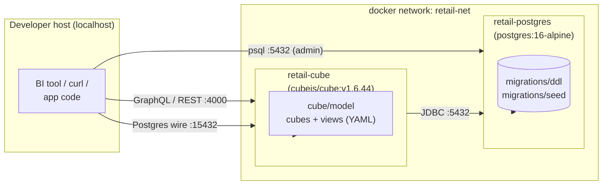
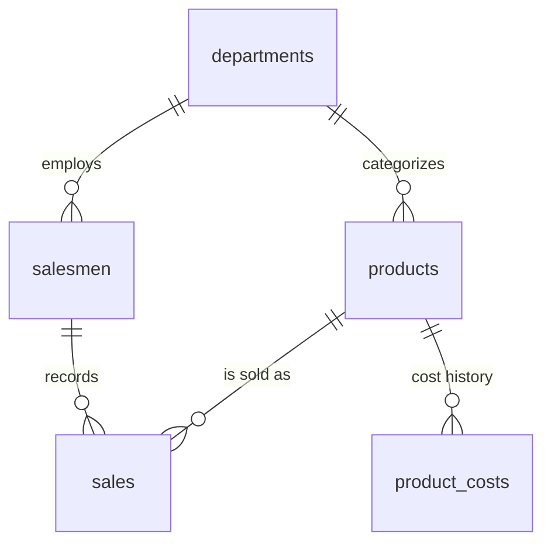

# Retail Cube — Postgres + Cube semantic layer

A self-contained, opinionated reference setup that turns a small retail database into a queryable semantic layer with a GraphQL API. Spin it up locally with Docker Compose, point a BI tool or your code at Cube, and stop hand-rolling SQL aggregations.

[]()
[]()
[]()

## Why this exists

Retail teams need answers like *"top salesmen by department this quarter"* or *"daily gross profit trend over the last 30 days"* without standing up a warehouse. This repository ships:

- A normalized Postgres schema for products, departments, salesmen, costs, and line-item sales.
- A reproducible seed of \~720 sales across 90 days so the analytics surface has something to chew on.
- A Cube semantic model (cubes + a flat view) that exposes measures (revenue, profit, margin %, units sold) and dimensions (department, salesman, time) over GraphQL, REST, and SQL.
- Helper scripts to reset the DB, open `psql`, and mint API tokens.

## Prerequisites

| Tool                                | Why                                              |
| ----------------------------------- | ------------------------------------------------ |
| Docker Desktop / OrbStack ≥ 4.0     | Runs the Postgres and Cube containers            |
| Docker Compose v2 (bundled)         | Orchestrates the stack                           |
| `curl` (or any HTTP client)         | Hits the Cube GraphQL API                        |
| Python 3 (preinstalled on macOS)    | Used by `scripts/cube-token.sh` to mint JWTs     |

No Node.js, Postgres CLI, or Cube CLI required on the host — everything runs inside containers.

## Quick start

Assuming Docker is running:

```bash
git clone <this-repo> retail-cube
cd retail-cube
cp .env.example .env                # then edit the placeholder secrets
docker compose up -d                # ~1 minute on first run while images pull
```

The first `docker compose up` will:

1. Pull `postgres:16-alpine` and `cubejs/cube:v1.6.44`.
2. Run every file in `migrations/ddl/` (creates schema), then every file in `migrations/seed/` (loads sample data) — exactly once, on a fresh data volume.
3. Boot Cube, which compiles the semantic model in `cube/model/` and waits for queries.

When it settles you should have:

| Service     | URL                                              | Notes                                             |
| ----------- | ------------------------------------------------ | ------------------------------------------------- |
| Postgres    | `postgres://retail@localhost:5432/retail`        | Bound to `127.0.0.1` only                         |
| Cube UI     | http://localhost:4000                            | Playground, schema explorer, query builder        |
| GraphQL API | http://localhost:4000/cubejs-api/graphql         | Has GraphiQL in dev mode                          |
| REST API    | http://localhost:4000/cubejs-api/v1              | `/load`, `/meta`, etc.                            |
| SQL API     | `postgres://cube@localhost:15432`                | Postgres wire protocol; point BI tools here       |

Verify it works:

```bash
curl -sS -X POST http://localhost:4000/cubejs-api/graphql \
  -H "Content-Type: application/json" \
  -d '{"query":"{ cube(orderBy:{ sales_analytics:{ gross_revenue: desc } }, limit: 3) { sales_analytics { product_department_name gross_revenue gross_profit total_quantity } } }"}'
```

You should see Electronics on top with a few hundred thousand in gross revenue. More queries are in `scripts/sample-queries.graphql`.

## Architecture



**Domain layout**

```
.
├── docker-compose.yml          orchestration: postgres + cube
├── .env.example                template; copy to .env
├── migrations/
│   ├── ddl/                    schema (executed first, alphabetical)
│   ├── seed/                   sample data (executed second, alphabetical)
│   └── init.sh                 runs DDL then seed inside the container
├── cube/
│   └── model/
│       ├── cubes/              one YAML per cube (departments, salesmen, ...)
│       └── views/              curated flat views (sales_analytics)
└── scripts/                    developer ergonomics (reset, psql, tokens, samples)
```

**Schema in one picture**



Sales rows snapshot both `unit_price` and `unit_cost` at the time of sale so historical reporting stays correct even when catalog prices or product costs change later. `product_costs` is a SCD2-lite table; the row with `effective_to IS NULL` is the *current* cost.

## What the semantic model exposes

There are five cubes and one curated view:

- **`departments`**, **`salesmen`**, **`products`**, **`product_costs`** — dimensional cubes with a `count` measure each (plus `avg_unit_price` / `avg_unit_cost` where it makes sense).
- **`sales`** — the fact cube. Measures: `count`, `total_quantity`, `gross_revenue`, `total_discount`, `total_cost`, `gross_profit`, `avg_order_value`, `profit_margin_pct`. Time dimension `sale_date` supports day / week / month / quarter / year out of the box.
- **`sales_analytics`** (view) — flat denormalized projection joining sales → salesmen → departments and sales → products → departments. The two department joins use prefixes (`salesman_department_*`, `product_department_*`) to avoid name collisions.

## Common analyses

Every example below targets the `sales_analytics` view via GraphQL. Drop them into the playground at <http://localhost:4000>.

```graphql
# Daily revenue & profit, last 30 days
{
  cube(
    where: { sales_analytics: { sale_date: { inDateRange: "last 30 days" } } }
    orderBy: { sales_analytics: { sale_date: asc } }
  ) {
    sales_analytics {
      sale_date { day }
      gross_revenue
      gross_profit
      total_quantity
    }
  }
}
```

```graphql
# Top 5 salesmen by revenue this quarter
{
  cube(
    where: { sales_analytics: { sale_date: { inDateRange: "this quarter" } } }
    orderBy: { sales_analytics: { gross_revenue: desc } }
    limit: 5
  ) {
    sales_analytics {
      salesmen_full_name
      salesman_department_name
      gross_revenue
      gross_profit
      profit_margin_pct
    }
  }
}
```

```graphql
# Department-level performance, current month
{
  cube(
    where: { sales_analytics: { sale_date: { inDateRange: "this month" } } }
    orderBy: { sales_analytics: { gross_revenue: desc } }
  ) {
    sales_analytics {
      product_department_name
      gross_revenue
      gross_profit
      total_quantity
      avg_order_value
    }
  }
}
```

More canned queries live in `scripts/sample-queries.graphql`.

## Developer scripts

```bash
./scripts/reset.sh         # nuke postgres volume, redeploy clean (re-runs DDL + seed)
./scripts/psql.sh          # interactive psql against the running database
./scripts/cube-token.sh    # mint a 1-hour JWT for use against the Cube API
./scripts/sample-graphql.sh # run a representative GraphQL query end-to-end
```

`./scripts/reset.sh` is the one you'll use whenever you change `migrations/ddl/*` or `migrations/seed/*` — Postgres only runs `/docker-entrypoint-initdb.d` scripts on a fresh data volume, so you have to drop the volume to re-run them.

If you change a `cube/model/*.yml` file you do **not** need a reset — Cube hot-reloads the semantic model on file changes.

## Configuration

All knobs live in `.env`. The most relevant:

| Variable             | Default              | Notes                                          |
| -------------------- | -------------------- | ---------------------------------------------- |
| `POSTGRES_DB`        | `retail`             | Database name                                  |
| `POSTGRES_USER`      | `retail`             | DB user (also Cube's `CUBEJS_DB_USER`)         |
| `POSTGRES_PASSWORD`  | *(no default)*       | **Required.** Generate with `openssl rand -base64 24` |
| `POSTGRES_PORT`      | `5432`               | Bound to `127.0.0.1` in `docker-compose.yml`   |
| `CUBE_PORT`          | `4000`               | HTTP / GraphQL                                 |
| `CUBE_SQL_PORT`      | `15432`              | Postgres wire-protocol SQL API                 |
| `CUBEJS_DEV_MODE`    | `true`               | Enables GraphiQL playground; **set `false` in prod** |
| `CUBEJS_API_SECRET`  | *(no default)*       | **Required.** Generate with `openssl rand -hex 32`   |
| `CUBEJS_LOG_LEVEL`   | `info`               | One of `error` / `warn` / `info` / `trace`     |

If you change a connection-related variable you must `docker compose up -d` (or `./scripts/reset.sh` for DB-level changes) to pick it up.

## Production hardening

The defaults in this repo prioritize developer experience over security. Before exposing this stack to anything resembling production, do at minimum:

1. **Disable dev mode** — set `CUBEJS_DEV_MODE=false`. This forces every API call to carry a JWT signed with `CUBEJS_API_SECRET`.
2. **Rotate secrets** — regenerate `POSTGRES_PASSWORD` and `CUBEJS_API_SECRET`. Treat `.env` as a secret artifact (sealed-secrets, Doppler, AWS Parameter Store, etc.).
3. **Lock down ports** — keep the localhost-only bindings or front Cube with an authenticating reverse proxy. Never expose Postgres directly.
4. **CORS allow-list** — set `CUBEJS_CORS=...` to the explicit list of frontends you trust. Never use `*`.
5. **TLS** — terminate HTTPS at your reverse proxy / ingress; Cube speaks plain HTTP behind it.
6. **Add real auth** — implement the `check_auth` config hook in a `cube/cube.py` (or `cube.js`) and validate user-issued JWTs against your IdP.
7. **Pin patch versions** — both `postgres:16-alpine` and `cubejs/cube:v1.6.44` are pinned; bump them deliberately and re-run smoke tests.

## Troubleshooting

**`POSTGRES_PASSWORD is required`** during `docker compose up` — you forgot to copy `.env.example` to `.env` (or the file is missing the variable).

**`Cube Store ... Read-only file system`** — happens if you mount `./cube` read-only. Cube's embedded metastore writes to `cube/.cubestore/`. The shipped compose file mounts the directory read-write and `.gitignore`s the runtime data.

**`Included member 'id' conflicts`** — Cube view error when two joined cubes expose a member with the same name. Either `excludes:` it or use `prefix: true` with an `alias:` (this is exactly what the two `departments` joins in `sales_analytics.yml` do).

**Schema changes don't show up** — Postgres only runs `/docker-entrypoint-initdb.d` scripts when the data volume is empty. Run `./scripts/reset.sh` to wipe and re-seed.

**Empty Cube responses** — open <http://localhost:4000>, navigate to *Schema* and check that the cubes load without errors. Also `docker compose logs cube` for compile errors.

**Port already in use** — change `POSTGRES_PORT`, `CUBE_PORT`, or `CUBE_SQL_PORT` in `.env` and recreate the stack.

## Tearing it down

```bash
docker compose down            # stop containers, keep data
docker compose down --volumes  # wipe DB and Cube Store as well
```
